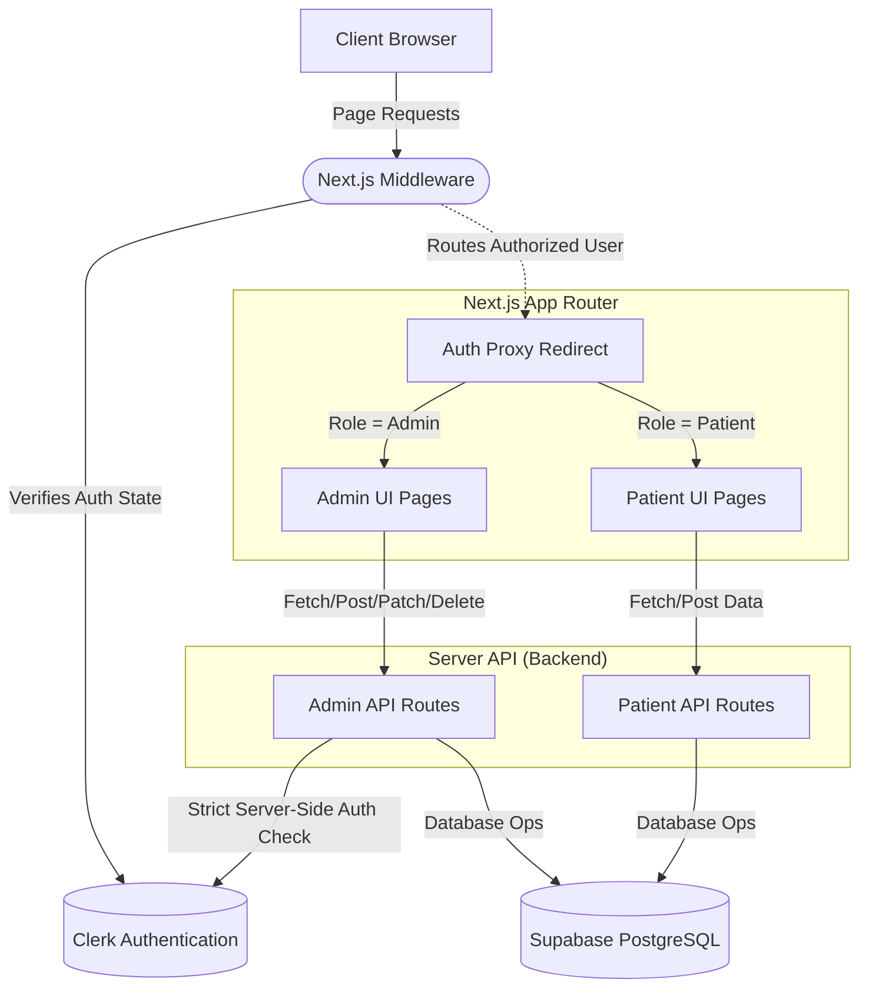
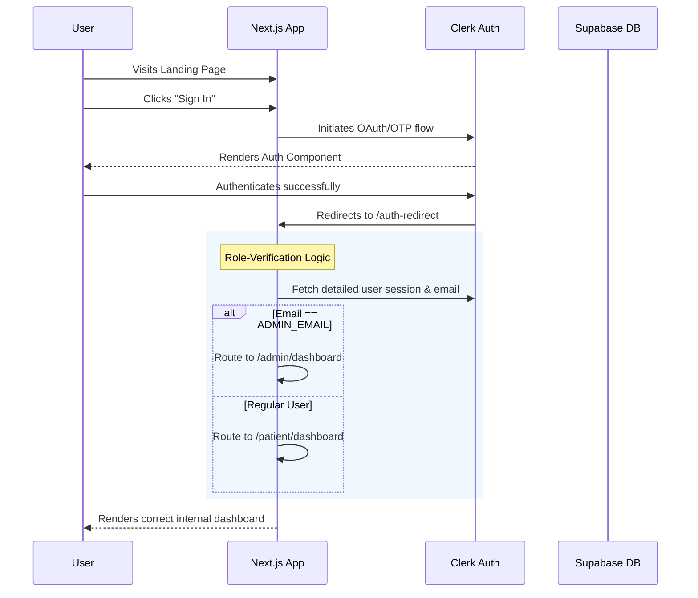

# 🏥 MedCare — Advanced Clinical Appointment System

<p align="center">
  
</p>

<p align="center">
  
  
  
  
  
  
</p>

MedCare is a high-fidelity, secure clinical SaaS platform designed to streamline medical appointments, manage doctor schedules, and provide patients with a seamless, premium healthcare booking experience. 

---

## ✨ Core Features

### 🔒 Strict Role-Based Security
- **Dual Isolation**: Distinct portals for Patients (`/patient/*`) and Administrators (`/admin/*`).
- **Middleware Protection**: Unauthenticated users are strictly blocked at the edge.
- **Server-Side Verification**: Admin APIs restrict access entirely based on a hardcoded, trusted administrator email verified via Clerk.

### 👥 Patient Portal
- **Dashboard**: Sleek, minimal overview showing upcoming, pending, and total appointments.
- **Dynamic Booking Flow**: Frictionless doctor selection, real-time availability checking, and slot booking.
- **Appointment Tracking**: Live status tracking (Pending, Approved, Rejected) including direct feedback/rejection notes from the administrator.

### 🛡️ Admin Controls
- **Doctor Management**: Complete CRUD operations for specialists, including automated bulk weekly slot generation.
- **Patient Registry**: A comprehensive view of all registered patients, their booking frequency, and direct one-click email contact capabilities via detailed modals.
- **Appointment Triage**: Approve or reject incoming appointments with required validation reasoning sent directly back to the patient.

---

## 🏗 System Architecture

MedCare relies on a scalable, serverless Next.js architecture heavily utilizing API routes for database abstraction, and Clerk for secure auth delegation.



---

## 🛤 User Flow (Authentication & Redirection)

To prevent session caching and infinite loops, MedCare uses a centralized proxy redirection strategy to ensure patients never see admin pages, and admins go straight to the dashboard.



---

## 🛠 Technology Stack

### Frontend
- **Framework:** [Next.js 15 (App Router)](https://nextjs.org/)
- **UI Library:** [React 19](https://react.dev/)
- **Styling:** [Tailwind CSS](https://tailwindcss.com/)
- **Icons:** [Lucide React](https://lucide.dev/)
- **Typography:** Inter (Google Fonts)

### Backend & Infrastructure
- **Database:** [Supabase](https://supabase.com/) (PostgreSQL)
- **Authentication:** [Clerk](https://clerk.com/)
- **API Architecture:** Next.js Route Handlers (`app/api/*`)
- **Deployment:** Vercel

---

## 💻 Local Development

### 1. Clone the repository
```bash
git clone https://github.com/divyanshu108-01/patient_appontment.git
cd patient_appontment
```

### 2. Install dependencies
```bash
npm install
```

### 3. Configure Environment Variables
Create a `.env.local` file in the root directory and add the following keys:

```env
# Clerk Authentication
NEXT_PUBLIC_CLERK_PUBLISHABLE_KEY=your_clerk_publishable_key
CLERK_SECRET_KEY=your_clerk_secret_key

# Supabase Database
NEXT_PUBLIC_SUPABASE_URL=your_supabase_project_url
NEXT_PUBLIC_SUPABASE_ANON_KEY=your_supabase_anon_key

# Clerk Redirects
NEXT_PUBLIC_CLERK_SIGN_IN_URL=/sign-in
NEXT_PUBLIC_CLERK_SIGN_UP_URL=/sign-up
```

### 4. Run the development server
```bash
npm run dev
```
Open [http://localhost:3000](http://localhost:3000) in your browser to see the result.

---

## 🎨 UI/UX Philosophy
The MedCare application implements a "Sharp Clinical" design language:
- **Palette**: Clean white spaces interspersed with robust primary blues (`brand-600`) and subtle semantic feedback colors (Emerald for approval, Amber for pending, Rose for rejection).
- **Componentry**: Lightly bordered components `border-slate-100` preventing jarring contrast, utilizing soft shadows for depth layering instead of harsh solid boundaries.
- **Typography**: Utilizing tight tracking (`tracking-tight`) on headers for a modern, dense software aesthetic, contrasted with open tracking (`tracking-wider`) on uppercase micro-labels.

---
<div align="center">
  <i>Built with precision for modern healthcare.</i>
</div>
